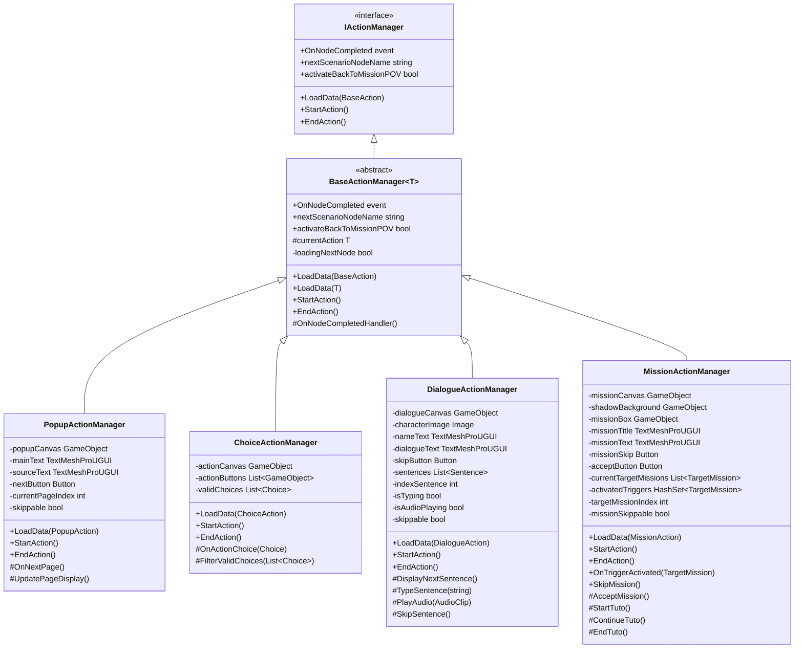
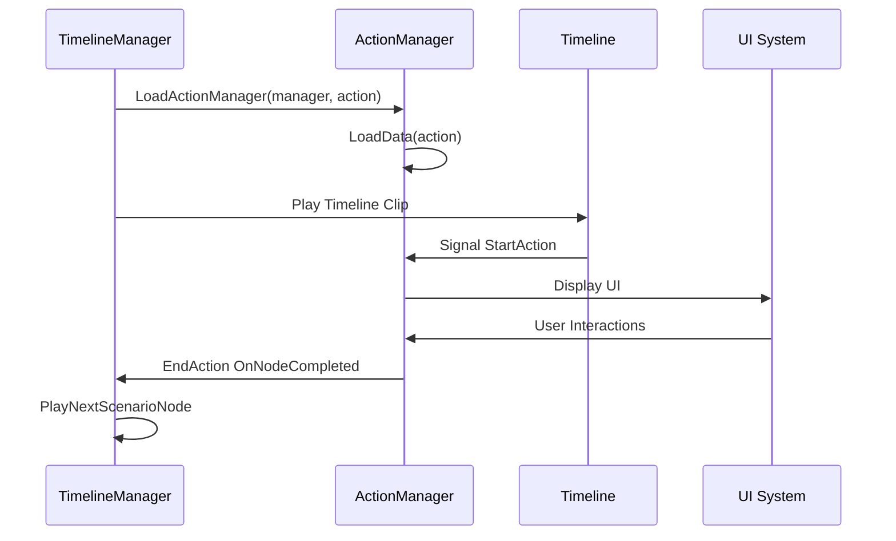
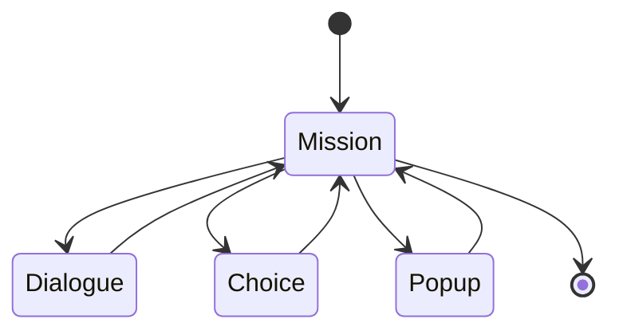

# 🎮 Endo'travail – Serious Game sur l'Endométriose au Travail (Unity)

Endo'Travail est un jeu narratif construit pour sensibiliser à l'endométriose en entreprise. Le jeu combine des séquences narratives, des missions interactives en vue TPS, des choix impactant la progression, et des contenus pédagogiques validés juridiquement et scientifiquement.

## ⚠️ Contenus manquants dans ce dépôt

Par respect du droit d'auteur :
- Pas de contenus narratifs (ScriptableObjects) d'EndoFrance
- Pas d'assets 3D du bureau Unity Asset Store

Pour exécuter le projet :
1. Créez vos propres ScriptableObjects
2. Intégrez votre propre environnement 3D
3. Adaptez les systèmes à votre propre scénario

## 📖 Contexte

65 % des personnes atteintes d’endométriose reconnaissent un impact négatif de la maladie sur leur quotidien professionnel selon l’enquête Endovie IPSOS Gederon Richter EndoFrance en janvier 2020.

Ainsi, nous avons créé “Endo’travail”, le serious game qui lève les tabous sur l’endométriose au travail !

Ce jeu a pour objectif de sensibiliser les salarié·e·s, les managers, et la Direction à l’impact de l’endométriose sur le quotidien professionnel. Il décrit quelques situations rencontrées par des personnes menstruées atteintes d’endométriose dans le cadre du travail. Il donne également des pistes pour vous aider à trouver des solutions. Les scénarios ont été relus et validés par une Avocate en droit du travail et un Médecin du travail.

Avertissement : Toute ressemblance avec la vie réelle est complètement préméditée et basée sur l’expertise d’EndoFrance et les témoignages de personnes atteintes d’endométriose. Bien évidemment, ce serious game ne peut pas être exhaustif. Chaque cas d’endométriose est unique et chaque situation personnelle, professionnelle aussi.


## 🧠 Vue d'ensemble technique

- Moteur de narration modulaire basé sur des ScriptableObjects
- Architecture orientée événements (Observer, State, Command, Factory, Strategy)
- Séquence de gameplay contrôlée via Timeline avec signaux et Cinemachine
- Système de flags narratifs avec pondération et transitions dynamiques
- TPS jouable avec triggers physiques
- Accessibilité pensée dès la conception pour un public large (jouable sur navigateur web et mobile, contrôles optimisés...)

## 🏗️ Architecture modulaire : Nœuds, Managers, Timeline

### 🔹 Nœuds narratifs typés
Chaque chapitre est un ScriptableObject contenant une liste typée de nœuds :

- **Dialogue** : texte + audio
- **Popup** : contenu pédagogique
- **Choice** : embranchements conditionnels
- **Mission** : TPS interactif
- Chaque nœud peut embarquer un **Badge** (récompense)

### 🔹 TimelineManager : orchestrateur central

Lecture de chaque nœud via :
- Chargement du manager (via LoadActionManager() – IActionManager → BaseActionManager<T>)
- Déclenchement Timeline : clip avec signaux Unity pour synchroniser contenu + déclenchements précis
- Exécution logique métier via StartAction(), puis EndAction() → transition au nœud suivant

### 🔹 Système de Flags narratifs

Les Flags permettent :
- De contrôler les embranchements (via conditions sur les nœuds ou les choix)
- De sauvegarder l'état narratif
- De pondérer les fins et scénarios selon les choix (logique de score, cohérence, retours dynamiques…)

## 🧬 Design Architecture – Extensible & SOLID

### ⚙️ Système de gestion des actions (IActionManager)

Le système repose sur trois couches modulaires :
- IActionManager : interface définissant le contrat d'action (exécution, complétion, retour à la mission…)
- BaseActionManager\<T> : classe abstraite gérant les éléments communs (cycle de vie, data binding, transitions…)
- Managers spécialisés : héritent de BaseActionManager et gèrent uniquement leur logique métier spécifique

```csharp unity
public class DialogueActionManager : BaseActionManager<DialogueAction> {
  public override void LoadAction(DialogueAction currentAction) {
    // Prepare content
  }
  
  public override void StartAction() {
    // Display & action
  }

  public override void EndAction() {
    // Hide & clean
  }
}
```

### 🔄 Cycle de vie d'un nœud narratif

1. TimelineManager charge le chapitre et le nœud courant
2. Appel de LoadActionManager() pour instancier le bon manager
3. Le TimelineClip déclenche le StartAction() via un signal
4. Interaction utilisateur → traitement
5. EndAction() est appelé → transition automatique au nœud suivant

## 🗺️ Arbre Narratif & Embranchements

### 🔁 Logique de navigation en condition et priorité

1. `HandleFlaggedNodes` → navigation dans une branche sélectionnée dynamiquement ou saut narratif selon la cohérence et le poids des choix passés (on prend le flag avec le plus de points)
2. Si null, `FindScenarioNodeByName` → navigation vers le noeud choisi par le joueur (Choice) ou trigger lors d'une mission (composition de Mission)
3. Si null, `GetNextNodeInBranchOrScenario` → navigation séquentielle et en remontant au parent jusqu'à la fin de chapitre

Permet de gérer :
- Branches scénaristiques cohérentes
- Fins alternatives selon les parcours
- Retours dynamiques en cas de boucle ou d'embranchement spécial (ux-friendly)

## 🧩 Types d'Actions – Zoom sur la logique métier

### 🎙️ Dialogue
- Affichage progressif du texte et audio
- Skippable en deux phases : Abrège texte et vidéos email avec audio conservé → Coupe l'audio et passe à la suite

### 📌 Popup
- Pages d'infos scientifiques, juridiques ou narratives
- Navigation multi-pages

### 🎯 Choice
- Influence directe du joueur sur le déroulé du scénario (embranchements conditionnels)
- Filtrage dynamique des choix selon flags (choix précédents et points des différentes fins)

### 🔫 Mission
- Vue TPS, contrôle du joueur, navigation dans l'environnement
- Triggers séquentiels → progression
- Tutoriel de prise en main
- Skippable à tout moment

## 🕹️ Accessibilité & Contrôles

### 💻 Clavier & Interface
- WASD / flèches / joystick virtuel (mobile) → Déplacement du joueur
- Espace → Skipper dialogues, vidéos, popups
- Échap → Pause

### ♿ Accessibilité prévue (roadmap)
- Navigation tab complète
- Missions entièrement au clavier
- Compatibilité lecteurs d'écran (Unity + HTML overlay)

## ⚙️ Build & Déploiement

### Pré-requis
- Unity 2022.3 LTS
- WebGL Build Support
- Addressables

### Étapes
1. Vérification des Addressables (prefabs, groupes)
2. Nettoyage cache
3. Compilation par chapitre avec groupe partagé (Duplicate Assets Isolation)
4. ComboBuild WebGL DiskSizeLTO + DXT / ASTC depuis **_Game Build Menu/Dual Build_**

### Optimisations
- Chargements asynchrones
- Cache CDN Cloudflare
- Profiling CPU/GPU

## 📊 Analytics
- Funnel de progression sur Unity Analytics
- Suivi par noeuds de scénario et flags
- Formulaire de satisfaction connecté à Framaforms
- Export automatisé (Python/Selenium)

## 🧱 Design Patterns
- Observer : Signaux / UI / transitions
- State : Navigation entre nœuds
- Command : Contrôles joueurs
- Factory : Création des actions
- Strategy : Logic métiers action managers

## ✅ Plateformes cibles
Navigateurs web desktop et mobile (Android 13+ / iOS 15+) supportant WebGL 2.0

## 👥 Crédits
- Développement Unity : [Romaric Beltran](https://www.linkedin.com/in/romaric-beltran/)
- Ingénierie pédagogique : [Diana Portela](https://www.linkedin.com/in/diana-portela/)
- Partenariat : [EndoFrance](https://endofrance.org/)

## 📑 Annexes Techniques

À consulter sur [Mermaid Live Editor](https://mermaid.live/)

### Diagrammes d'Architecture



### Flux de Gestion des Nœuds



### Gestion des États Mission


